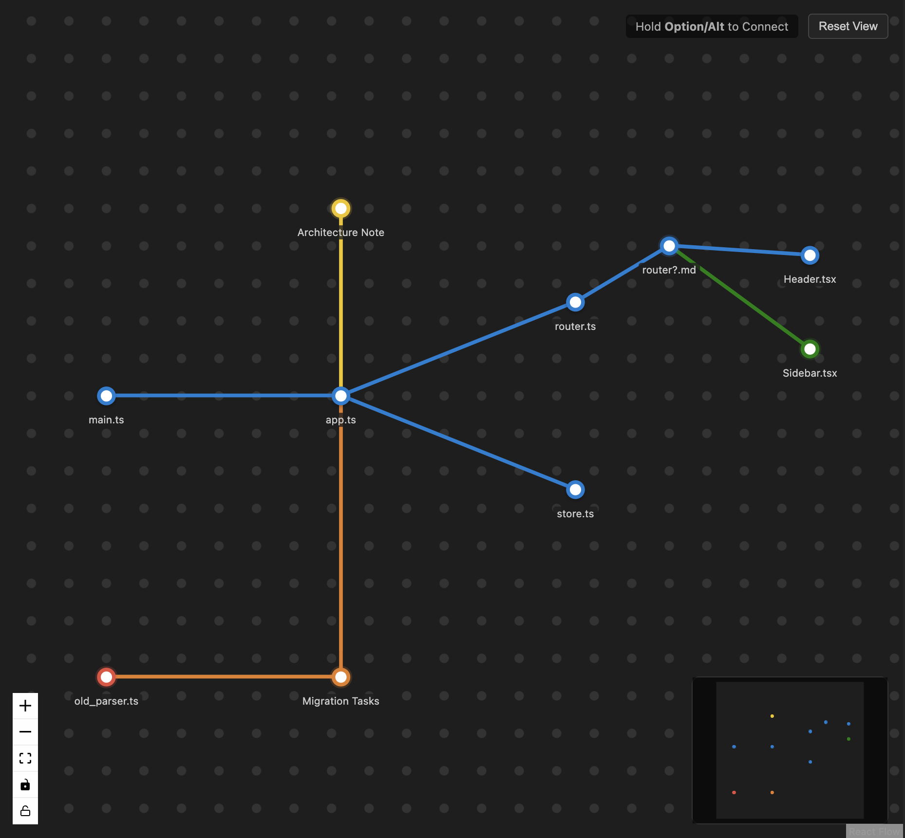

# File Metro

**File Metro** visualizes your workspace as a metro map. Files are stations, dependencies are lines.

## Philosophy

I built File Metro based on a simple belief: **links should be intentional**.

In an era of auto-generated backlinks and knowledge graphs, I found that true understanding comes from *gardening* your connections, not just accumulating them. I wanted a tool that forces me to manually curate the relationships between my notes—to treat my knowledge base as a spatial map rather than a database.

Personally, I found this **spatial, manual approach** to be very comfortable for coding as well. Visualizing your codebase as a metro map helps you build a mental model of your project's architecture that a file tree simply can't match.

## Features

*   **Visual Map**: Drag & drop files to create stations.
*   **Connections**: Hold `Alt` + Drag between stations to link them.
*   **Organization**: Color code stations and add status marks (Check, Star).
*   **Batch Actions**: Multi-select (`Shift` + Click) to color, mark, or delete groups.
*   **Theme Aware**: Adapts to Light and Dark modes.

## Usage

1.  Open Command Palette (`Cmd+Shift+P`).
2.  Run **"Metro: Open Metro View"**.
3.  Drag files from Explorer to the map.

## Shortcuts

| Action | Shortcut |
| :--- | :--- |
| **Connect Stations** | Hold `Alt` + Drag |
| **Multi-Select** | Hold `Shift` + Click / Drag |
| **Toggle Default Mark** | `Ctrl` / `Cmd` + Click Station |
| **Open File** | Double Click Station |
| **Pan Canvas** | Drag Background (if unlocked) |
| **Zoom** | Scroll Wheel (if unlocked) |

## Contributing

See [CONTRIBUTING.md](CONTRIBUTING.md).
